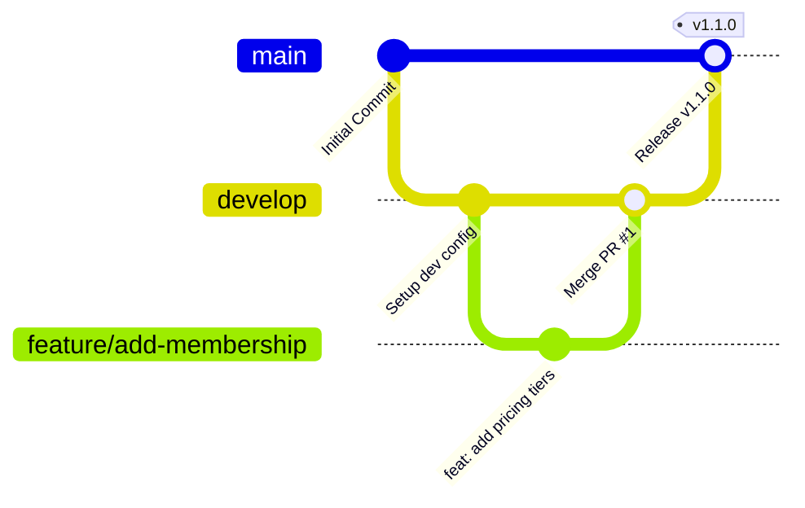

# Git Branching Strategy & DevOps Workflow

This document outlines the professional branching model, coding workflow, and deployment integration for the **Apex Sports Complex** project. As a professional Cloud & DevOps environment, we strictly follow this workflow to ensure production stability, automated testing, and clear release management.

---

## 🏗️ Branching Model Overview (GitFlow Light)

We use a modified GitFlow branching model centered around two persistent branches (`main` and `develop`) and dynamic supporting branches (`feature/*`, `bugfix/*`, and `hotfix/*`).



### 1. Persistent Branches

#### 🏟️ `main` (Production)
* **Purpose**: Production-ready code. This branch represents what is currently live in production.
* **Access**: Locked. No direct commits allowed. Updates only happen via approved Pull Requests (PRs) from `develop`.
* **CI/CD Impact**: Every push or merge to `main` automatically triggers the build, smoke test, and **direct deployment** to the DigitalOcean server.

#### 🛠️ `develop` (Integration / Staging)
* **Purpose**: Staging and active integration branch. Developers merge their features here.
* **Access**: No direct commits allowed for main features. Code enters `develop` through PRs from feature branches.
* **CI/CD Impact**: Every push or PR targeting `develop` triggers the automated Docker build and smoke tests to ensure code integrity.

---

### 2. Supporting Branches (Short-Lived)

#### ✨ Feature Branches (`feature/<name-of-feature>`)
* **Purpose**: Development of new features or configuration updates.
* **Source Branch**: `develop`
* **Destination Branch**: `develop` (via Pull Request)
* **Naming Convention**: `feature/short-description` (e.g., `feature/membership-plans`, `feature/azure-terraform`)

#### 🐛 Bugfix / Hotfix Branches (`bugfix/*` or `hotfix/*`)
* **Purpose**: Fixing bugs in develop (`bugfix/`) or critical bugs in production (`hotfix/`).
* **Source Branch**: `develop` (for bugfix) or `main` (for hotfix)
* **Destination Branch**: `develop` / `main`
* Naming Convention: `bugfix/issue-description` or `hotfix/critical-fix`

---

## ✍️ Commit Message Guidelines

We follow the **Conventional Commits** standard to make our repository history clean and readable.

Format: `<type>(<scope>): <description>`

### Common Types:
* `feat`: A new feature (e.g., `feat(ui): add booking form calendar`)
* `fix`: A bug fix (e.g., `fix(nginx): resolve CORS preflight header issue`)
* `chore`: Maintenance tasks or tool updates (e.g., `chore(git): ignore terraform build artifacts`)
* `docs`: Documentation changes (e.g., `docs: update deployment guide with SSL steps`)
* `ci`: CI/CD configuration updates (e.g., `ci(github): add develop branch triggers`)

---

## 🔄 Pull Request & Review Workflow

To merge code into `develop` or `main`:

1. **Create Feature Branch**:
   ```bash
   git checkout develop
   git pull origin develop
   git checkout -b feature/my-amazing-feature
   ```
2. **Commit & Push**: Commit work locally using conventional commits, then push to GitHub:
   ```bash
   git push -u origin feature/my-amazing-feature
   ```
3. **Open Pull Request**: 
   - Open a PR targeting `develop`.
   - The Pull Request Template will load automatically. Complete the checklist.
4. **CI/CD Validation**: The GitHub Actions pipeline will build the Docker container and run smoke tests.
5. **Code Review**: A fellow developer/engineer must review and approve the code.
6. **Merge**: Once approved and checks pass, merge the PR (squash-merge is recommended).

---

## 🔒 Step-by-Step: Setting Up Branch Protection Rules on GitHub

To protect `main` and `develop` branches from accidental overwrites:

1. Go to your GitHub Repository page.
2. Click on **Settings** (top navigation bar).
3. Click on **Branches** (left sidebar).
4. Under **Branch protection rules**, click **Add branch ruleset** or **Add rule**.
5. Configure the rules for `main` and `develop`:
   - **Branch pattern**: `main` (and a second rule for `develop`)
   - **Check the following options**:
     - ✅ *Require a pull request before merging*
     - ✅ *Require approvals* (set to 1 approval)
     - ✅ *Require status checks to pass before merging* (search for and check `Build Docker Image` to ensure pipeline must pass)
     - ✅ *Do not allow bypassing the above settings*
6. Click **Create** / **Save changes**.
